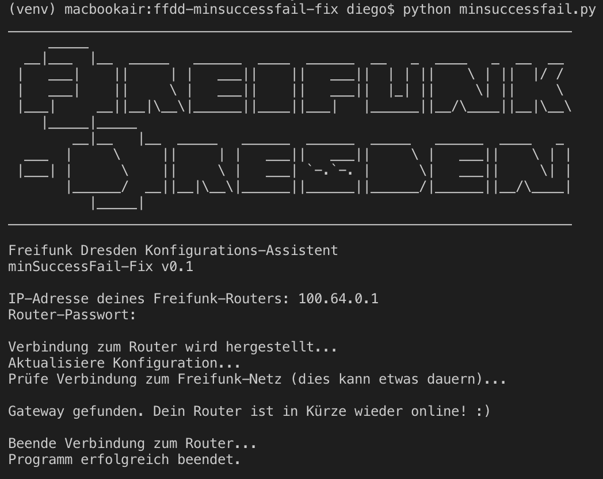

# Fix für den minSuccessFail-Bug bei FFDD-Routern

<a href="https://raw.githubusercontent.com/jdieg0/ffdd-minsuccessfail-fix/master/assets/images/minsuccessfail-fix_output.png"></a>

In der Freifunk-Firmware ab Version 5.0.5 aufwärts tritt seit 25.07.2019 ein Fehler auf, der dazu führt, dass der betroffene Knoten offline geht.

## Ursache

Grund hierfür ist eine Routine in ```/usr/lib/ddmesh/ddmesh-gate-check.sh```, die wegen einer Reihe von nicht mehr erreichbaren externen Servern keine Route mehr setzt. Leider hat Freifunk Dresden keine Möglichkeit, das Problem serverseitig zu beheben.

Das hier zur Verfügung gestellte kleine Konfigurations-Skript „minsuccessfail-fix“ setzt in ```ddmesh-gate-check.sh``` den Schwellwert ```minSuccessful```, ab dem der Knoten sich online wähnt und wieder eine Verbindung aufbaut, nach unten und prüft im Anschluss die Verbindung.

(Weiterhin gibt es auch die Möglichkeit, ein (anderes) Software-Paket (IPK) über die grafische Weboberfläche des Routers nachzuinstallieren. Infos dazu gibt es im [Wiki](https://wiki.freifunk-dresden.de/index.php/Firmware_Fix:_gateway-check)).

## Anleitung

- Verbinde dich per WLAN mit deinem Router „FF no-inet [XXXX]“.
- Starte das Programm ([Varianten](#varianten) siehe unten). Die IP-Adresse ```100.64.0.1``` kannst du in der Regel mit ```Enter``` bestätigen.
- Gib dein Router-Passwort ein. Nicht wundern, beim Tippen bewegt sich auf dem Bildschirm nichts.
- Im Idealfall sollte das Programm durchlaufen und vermelden, dass wieder ein „Gateway gefunden“ wurde und sich ohne Fehlermeldung selbst beenden.

## Varianten

### Bundles

Die einfachste Möglichkeit besteht darin, ein fertiges Bundle zu verwenden. Es existieren ausführbare Bundles für folgende Systeme:

- [macOS](https://github.com/jdieg0/ffdd-minsuccessfail-fix/raw/master/dist/minsuccessfail-fix/minsuccessfail-fix_macos.zip) (*getestet unter macOS Mojave 10.14.5*)

### Python

Das Python-Skript könnt ihr auch direkt selbst ausführen, allerdings müssen dafür Python 3 und die Pakete ```ipython``` und ```paramiko``` installiert sein.

    $ python3 -m venv venv
    $ source venv/bin/activate
    $ pip install ipython paramiko
    $ python minsuccessfail-fix.py
    ______________________________________________________________________
        _____                                                             
    __|___  |__  _____   ______  ____  ______  __   _  ____   _  __  __  
    |   ___|    ||     | |   ___||    ||   ___||  | | ||    \ | ||  |/ /  
    |   ___|    ||     \ |   ___||    ||   ___||  |_| ||     \| ||     \  
    |___|     __||__|\__\|______||____||___|   |______||__/\____||__|\__\ 
        |_____|_____                                                       
            __|__   |__  _____   ______  ______  _____   ______  ____   _  
    ___  |     \     ||     | |   ___||   ___||     \ |   ___||    \ | | 
    |___| |      \    ||     \ |   ___| `-.`-. |      \|   ___||     \| | 
        |______/  __||__|\__\|______||______||______/|______||__/\____| 
            |_____|                                                      
    ______________________________________________________________________

    Freifunk Dresden Konfigurations-Assistent
    minSuccessFail-Fix v0.1

    IP-Adresse deines Freifunk-Routers: 100.64.0.1
    Router-Passwort: 

    Verbindung zum Router wird hergestellt...
    Aktualisiere Konfiguration...
    Prüfe Verbindung zum Freifunk-Netz (dies kann etwas dauern)...

    Gateway gefunden. Dein Router ist in Kürze wieder online! :)

    Beende Verbindung zum Router...
    Programm erfolgreich beendet.

### Bundles selbst erzeugen

Bundles für das eigene Betriebssystem können mittels [PyInstaller](https://pyinstaller.readthedocs.io/en/stable/usage.html) erzeugt werden.

    $ pip install pyinstaller
    $ pyinstaller minsuccessfail-fix.py

Im Ordner ```dist/minsuccessfail-fix/``` findet sich dann je nach Betriebssystem die ausführbare Datei ```minsuccessfail-fix``` (macOS, Linux) oder ```minsuccessfail-fix.exe``` (Windows).

## Weiterführende Infos

- [Freifunk-Wiki](https://wiki.freifunk-dresden.de/index.php/Firmware_Fix:_gateway-check)
- [Freifunk-Forum](https://forum.freifunk.net/t/ddmesh-gateway-check-sh/)

## Kontakt und Fragen

[Diego](mailto:diego@freifunk-dresden.de?cc=info@freifunk-dresden.de&subject=minSuccesFail-fix)